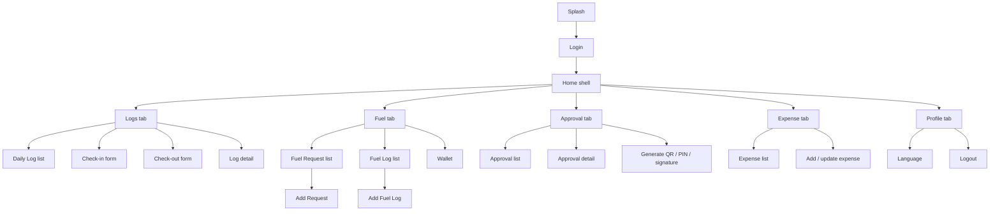

# App flow

Status: **as-built** (not confirmed).  
Visual: [preview — screen mock](preview/index.html#screen-mock).  
Parked changes: [better-to-do](better-to-do.md#app-flow).

Any mobile dev: this is the product from head to toe. Roles change which tabs exist, not the idea of list → form → detail.

---

## Roles

| `driverType` | Bottom tabs | Notes |
|---|---|---|
| Driver / corporate (not `office`) | Log, Fuel, Approval, Expense, Profile | Approval + Fuel Request + Wallet |
| `office` | Log, Fuel, Expense, Profile | No Approval. Fuel tabs = Fuel Log + Wallet only |

---

## Diagram

Logsheet tab exists in code (`LogSheetNavHost`) but `ENABLE_LOG_SHEET_TAB = false` on `LogTabScreen`.

---

## Shell

| Piece | Behavior |
|---|---|
| `AppNavigation` | splash, login, home. Login → home slides **up**. Logout event pops to login |
| `HomeScreen` | custom tab switch (not NavHost for tabs). Saveable state per tab |
| Bottom bar | hidden on form/detail routes (check-in, checkout, log detail, add fuel, fuel details, approval detail, add expense, expense detail) |
| Collapsible chrome | list scroll hides page title + bottom bar; inner segmented tabs stay |
| Network title | Telegram-style: title ↔ “Waiting for network…” / “Connecting…” (450 ms debounce) |

---

## Module jobs (current)

### Logs

- List daily logs with date filter, pagination, offline/syncing badges, start/end km photos, Checkout when `isCheckout == "true"`.
- Check-in (daily vs trip) saves local-first when offline.
- Check-out completes the open log.
- Detail is read-only.
- Create: header **Add Log** (logsheet add hidden).

### Fuel

- Request list / log list / wallet (office skips request).
- Add Request, Add Fuel Log, details.
- Wallet is online-oriented (reconnect refetch in ViewModel).

### Approval

- Pending list, select-all, **Generate QR**, detail, QR scan vs PIN + signature approve, Close / Approve / Continue in dialogs.

### Expense

- List + filter card, add/update, detail.

### Profile

- User info, language, logout (danger outline button). Version skip lives with update bottom sheet on lists.

---

## Form vs list

Lists: `colorSecondary` page (`#F1F2F6`), white cards, bottom bar visible.  
Forms: often white scaffold, bottom bar hidden, `FormPrimaryButton` at the bottom, IME padding via `formScrollInsets`.
